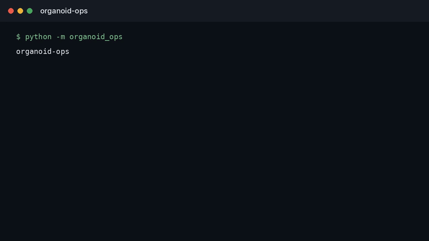

# organoid-ops

**Experiment infrastructure for neural organoid work: which protocol, which day, which assay window.**

**Status:** problem brief. The question and the measurement are written here. An implementation is not in this repository yet.

---

## Watch

  

The clip plays on this page. [Full video](docs/demo.mp4).

## The problem

Neural organoid results are hard to compare because the experiment is not a single object. Media recipe, days in vitro, plating density, and the hour the assay was read all change the biology. Papers compress that into a methods paragraph. The next lab cannot tell whether they repeated the experiment or a cousin of it.

The infrastructure gap is not another analysis notebook. It is a record of the run that an analysis can point at.

## The record I would trust

| Object | What it fixes |
| --- | --- |
| Protocol version | A changed supplement is a new protocol, not a silent edit |
| Plate map | Which well was which line, written before the assay |
| Assay window | Day and clock time, not "about week 8" |
| Run id on every result file | A plot that cannot name its run does not enter the comparison |

Two results are comparable only when those four agree, or when the disagreement is the thing being studied. Pooling them first and explaining later is how organoid papers talk past each other.

## What this repository is

The record a neural-organoid experiment needs before anyone argues about the signal. Nearby work on public neural data lives in [eeg-harmonize](https://github.com/TechieGoku2623/eeg-harmonize) and [neuroprivacy](https://github.com/TechieGoku2623/neuroprivacy). This repository does not include organoid data or a lab system.

## Author

**Choppa Devasai Pranatheswar** · [LinkedIn](https://www.linkedin.com/in/devasai-pranatheswar)
